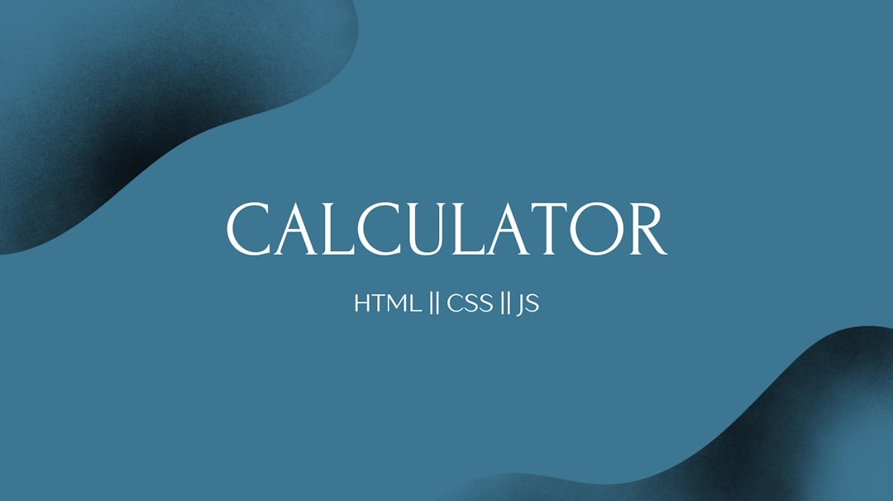

# krheena.github.io
my portfolio
<!DOCTYPE html>
<html lang="en">
<head>
    <meta charset="UTF-8">
    <meta name="viewport" content="width=device-width, initial-scale=1.0">
    <title>Heena | Portfolio</title>
    <link rel="stylesheet" href="style.css">

    <link rel="stylesheet" href="https://cloudflare.com">
   
</head>
<body>
    <nav class="navbar">
        
Heena

        <ul class="nav-links">
            <li><a href="#">Home</a></li>
            <li><a href="#">About</a></li>
            <li><a href="#">Skills</a></li>
            <li><a href="#">Projects</a></li>
            <li><a href="#">Certifications</a></li>
            <li><a href="#">Contact</a></li>
        </ul>
        

            <a href="https://github.com/krheena">
              <i class="fab fa-github"></i> GitHub</a>
            <a href="https://www.linkedin.com/in/krheena/">
              <i class="fab fa-linkedin"></i> LinkedIn</a>
            <a href="#" class="btn-resume">Download Resume</a>
        

    </nav>

   <header class="hero">
        

            <!-- Replace with your actual image path -->
            
        

        <h1 class="hero-title">Heena | Machine Learning & Python Developer</h1>
    </header>

  <section class="about-section">
        <h2>About Me</h2>
        

            Currently pursuing my B.Tech in Computer Science & Engineering at Rayat Institute of 
            Engineering and Technology (2021-2025). I approach every project with deep analytical 
            thinking and maintain a highly positive, dedicated attitude to foster healthy 
            organizational functioning.
        

    </section>

  <!-- Card 1 -->
  

    

      🎓
    

    <h3>B.Tech in Computer Science</h3>
    
Rayat Institute of Engineering and Technology

    

      2021 - 2025
      CGPA 7.15
    

  

  <!-- Card 2 -->
  

    

      ✔️
    

    <h3>12th Grade (Senior Secondary)</h3>
    
Punjab School Education Board (PSEB)

    

      Completed
      73%
    

  

  <!-- Card 3 -->
  

    

      📖
    

    <h3>10th Grade (Matriculation)</h3>
    
Punjab School Education Board (PSEB)

    

      Completed
      70%
    

  

   <section class="profile-container">
    <!-- Left Column: Background & Education -->
    

        <h1 class="title">Background &  Education</h1>
        

            

                B.Tech in Computer Science & Engineering (2021-2025) from 
                Rayat Institute of Engineering and Technology (CGPA 7.15). 
                Based in Nawanshahr, Punjab, India.
            

        

    

   <!-- Right Column: Core Strengths -->
    

        

            <h2 class="subtitle">Core Strengths</h2>
            <ul class="strengths-list">
                <li>Positive attitude</li>
                <li>Deep project analysis</li>
                <li>Highly dedicated</li>
                <li>Self-confident</li>
            </ul>
        

    

</section>

<section class="skills-section">
  <h2>Technical Skills</h2>
  
Proficient in modern data science tools and web frameworks.

</section>

   

        <!-- Card 1 -->
        

            <h2>Languages</h2>
            

            <ul>
                <li>Python</li>
                <li>HTML</li>
            </ul>
        

  <!-- Card 2 -->
        

            <h2>Machine Learning</h2>
            

            <ul>
                <li>Supervised/Unsupervised</li>
                <li>Scikit-learn</li>
            </ul>
        

<!-- Card 3 -->
        

            <h2>Data Analysis</h2>
            

            <ul>
                <li>Pandas</li>
                <li>NumPy</li>
                <li>Matplotlib</li>
            </ul>
        

   <!-- Card 4 -->
    

  <h2>Tools</h2>
  

  <ul>
    <li>MySQL</li>
    <li>GitHub</li>
  </ul>

 

<section class="projects-section">
    

        

            <h2>Featured Projects</h2>
            
A selection of my recent work in Machine Learning and Python development.

        

   

  

    <h2 class="project-title">Fraud Credit Card Detection (ML)</h2>
    <a href="https://github.com/krheena/fraud_credit_card_detection" class="view-project">
        View Project 
        &rarr;
    </a>
  

 

    <h2 class="project-title">Specific Calculator</h2>
    <a href="https://github.com/krheena/specific_calculator" class="view-project">
        View Project 
        &rarr;
    </a>

 

    <h2 class="project-title">Restaurant Menu & Billing System</h2>
    <a href="https://github.com/krheena/restaurant-menu-billing-system" class="view-project">
        View Project 
        &rarr;
    </a>

<section class="certifications-section">
  

    <h2 class="title">Certifications</h2>
    
Continuous learning to stay ahead in the evolving tech landscape.

    

      <!-- Certification Item -->
      <a href="#" class="cert-card">
        

          CERTIFICATION
          <h3 class="cert-name">Python</h3>
        

        

          <svg width="24" height="24" viewBox="0 0 24 24" fill="none" stroke="currentColor" stroke-width="2" stroke-linecap="round" stroke-linejoin="round"><line x1="7" y1="17" x2="17" y2="7"></line><polyline points="7 7 17 7 17 17"></polyline></svg>
        

      </a>

  <a href="#" class="cert-card">
        

          CERTIFICATION
          <h3 class="cert-name">Google Analytics</h3>
        

        

          <svg width="24" height="24" viewBox="0 0 24 24" fill="none" stroke="currentColor" stroke-width="2" stroke-linecap="round" stroke-linejoin="round"><line x1="7" y1="17" x2="17" y2="7"></line><polyline points="7 7 17 7 17 17"></polyline></svg>
        

      </a>

  <a href="#" class="cert-card">
        

          CERTIFICATION
          <h3 class="cert-name">Machine Learning</h3>
        

        

          <svg width="24" height="24" viewBox="0 0 24 24" fill="none" stroke="currentColor" stroke-width="2" stroke-linecap="round" stroke-linejoin="round"><line x1="7" y1="17" x2="17" y2="7"></line><polyline points="7 7 17 7 17 17"></polyline></svg>
        

      </a>
      <a href="#" class="cert-card">
        

          CERTIFICATION
          <h3 class="cert-name">Ethical Hacking (Beginner)</h3>
        

        

          <svg width="24" height="24" viewBox="0 0 24 24" fill="none" stroke="currentColor" stroke-width="2" stroke-linecap="round" stroke-linejoin="round"><line x1="7" y1="17" x2="17" y2="7"></line><polyline points="7 7 17 7 17 17"></polyline></svg>
        

      </a>

  <a href="#" class="cert-card">
        

          Achievement
          <h3 class="cert-name">National competition 2018</h3>
        

        

          <svg width="24" height="24" viewBox="0 0 24 24" fill="none" stroke="currentColor" stroke-width="2" stroke-linecap="round" stroke-linejoin="round"><line x1="7" y1="17" x2="17" y2="7"></line><polyline points="7 7 17 7 17 17"></polyline></svg>
        

      </a>
     <a href="#" class="cert-card">
        

          Achievement
          <h3 class="cert-name">Prabuddh Bharat Foundation</h3>
        

        

          <svg width="24" height="24" viewBox="0 0 24 24" fill="none" stroke="currentColor" stroke-width="2" stroke-linecap="round" stroke-linejoin="round"><line x1="7" y1="17" x2="17" y2="7"></line><polyline points="7 7 17 7 17 17"></polyline></svg>
        

      </a>

   <a href="#" class="cert-card">
        

          Achievement
          <h3 class="cert-name">Suits (National law fest)</h3>
        

        

          <svg width="24" height="24" viewBox="0 0 24 24" fill="none" stroke="currentColor" stroke-width="2" stroke-linecap="round" stroke-linejoin="round"><line x1="7" y1="17" x2="17" y2="7"></line><polyline points="7 7 17 7 17 17"></polyline></svg>
        

      </a>
    

  

</section>

<section class="contact-section">
    

        <h1>Let's Connect</h1>
        
Currently open for opportunities. Reach out via email or connect on LinkedIn.

    

<section class="contact-section">
  

    <!-- Left Side: Contact Info -->
    

      

        <h3>EMAIL</h3>
        
krheenababu@gmail.com

      

      

        <h3>PHONE</h3>
        
+91 8xxxx-20xx0

      

      

        <h3>LINKEDIN</h3>
        
linkedin.com/in/krheena

      

    

  <!-- Right Side: Contact Form -->
    <form class="contact-form">
      

        <label>NAME</label>
        <input type="text" placeholder="Enter your name">
      

      

        <label>EMAIL</label>
        <input type="email" placeholder="Enter your email address">
      

      

        <label>MESSAGE</label>
        <textarea rows="6" placeholder="How can we work together?"></textarea>
      

      <button type="submit" class="submit-btn">SEND MESSAGE</button>
    </form>
  

</section>

<footer class="footer">
  

    <!-- Column 1: Intro -->
    

      <h2 class="brand-name">Heena</h2>
      
Machine Learning & Python Developer. Translating data into actionable insights and building intelligent systems.

    

 <!-- Column 2: Quick Links -->
    

      <h3>Quick Links</h3>
      <ul>
        <li><a href="#">Home</a></li>
        <li><a href="#">About Me</a></li>
        <li><a href="#">Technical Skills</a></li>
        <li><a href="#">Featured Projects</a></li>
        <li><a href="#">Certifications</a></li>
        <li><a href="#">Contact</a></li>
      </ul>
    

<!-- Column 3: Connect -->
    

      <h3>Connect</h3>
      

      <!-- Replace # with your social media links -->
        
        
        
      

    

  

  

    
&copy; 2025 Heena. All rights reserved.

  

</footer>

</body>
</html>
